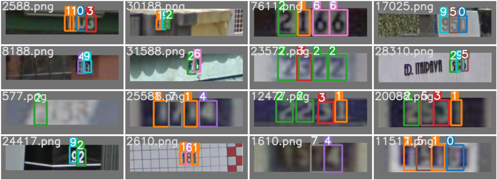

#  SVHN Object Detection

This repository is the implementation of CodaLab competitions [SVHN Object Detection](https://reurl.cc/Q6N0M2). 

test label result



## Fork from yolov5

https://github.com/ultralytics/yolov5

## Requirements

To install requirements:

```setup
pip install -r requirements.txt
```

## Training

To train the model(s), run this command:

```train
python3 train_yolov5.py --data ./data/SVHN.yaml --batch 16 --epochs 50 --cfg models/yolov5x.yaml --name svhw_yolov5x_pre_320 --weights yolov5x.pt --imgsz 320
```

* scheduler use `ReduceLROnPlateau`
* optimizer  use `SGD`, momentum = 0.937, weight_decay = 5e-4
* Data augmentation(HSV-Hue augmentation, HSV-Saturation augmentation, HSV-Value augmentation, image translation, image scale)

## Reproduceing Submission(Inference)

[model link](https://drive.google.com/file/d/1ogQIq5IpsxPJ94RMBj0IC3HJumWlIAHr/view?usp=sharing)

To Inference my model: [inference.ipynb](https://colab.research.google.com/github/a07458666/digital_object_detection/blob/master/inference.ipynb)

>📋 Will output `answer.json`
## Pre-trained Models

You can download pretrained models here:

[assets]: https://github.com/ultralytics/yolov5/releases
[TTA]: https://github.com/ultralytics/yolov5/issues/303

|Model |size<br><sup>(pixels) |mAP<sup>val<br>0.5:0.95 |mAP<sup>val<br>0.5 |Speed<br><sup>CPU b1<br>(ms) |Speed<br><sup>V100 b1<br>(ms) |Speed<br><sup>V100 b32<br>(ms) |params<br><sup>(M) |FLOPs<br><sup>@640 (B)
|---                    |---  |---    |---    |---    |---    |---    |---    |---
|[YOLOv5m][assets]      |640  |45.2   |63.9   |224    |8.2    |1.7    |21.2   |49.0
|[YOLOv5x][assets]      |640  |50.7   |68.9   |766    |12.1   |4.8    |86.7   |205.7


## Results

My model achieves the following performance on :

### Object Detection

| Model name         |       mAP       |
| ------------------ |---------------- |
| My best model      |     0.42334     |


## Resources:

- [yolov5](https://github.com/ultralytics/yolov5)
- [DynamicHead Github](https://github.com/microsoft/DynamicHead)
- [Microsoft Open Source Code of Conduct](https://opensource.microsoft.com/codeofconduct/)
- [Microsoft Code of Conduct FAQ](https://opensource.microsoft.com/codeofconduct/faq/)
- Contact [opencode@microsoft.com](mailto:opencode@microsoft.com) with questions or concerns
